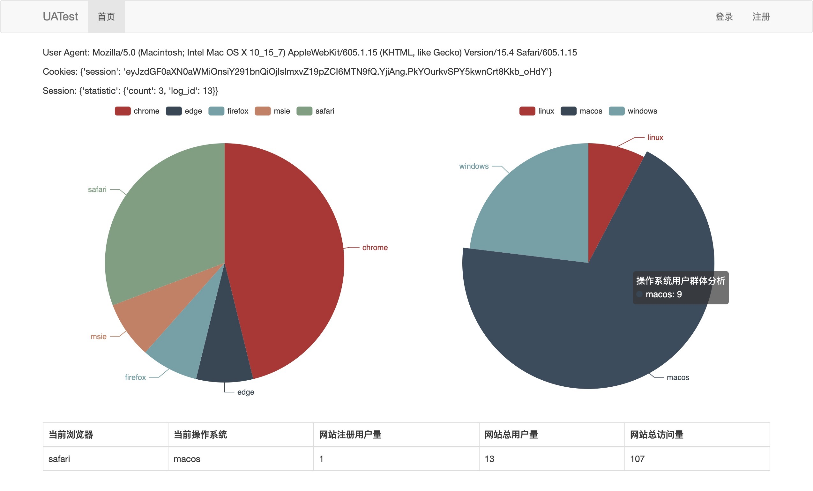

# UATest

* 针对User-Agent的网站编程
  * 有Session和Cookie的，需要提供IP地址和登陆账号供老师检验。

* 对HTTP协议的请求-响应过程及协议数据封装进行详细分析，编写一个页面，能够记录客户端User-Agent信息，并根据访问请求的User-Agent返回不同内容；并熟练使用session和cookie

## 部署

* 安装依赖

```bash
pip install -r requirements.txt
```

* 创建数据库

```bash
flask db init
flask db migrate
flask db upgrade
```

## 运行

```bash
flask saika run
```

## 预览


